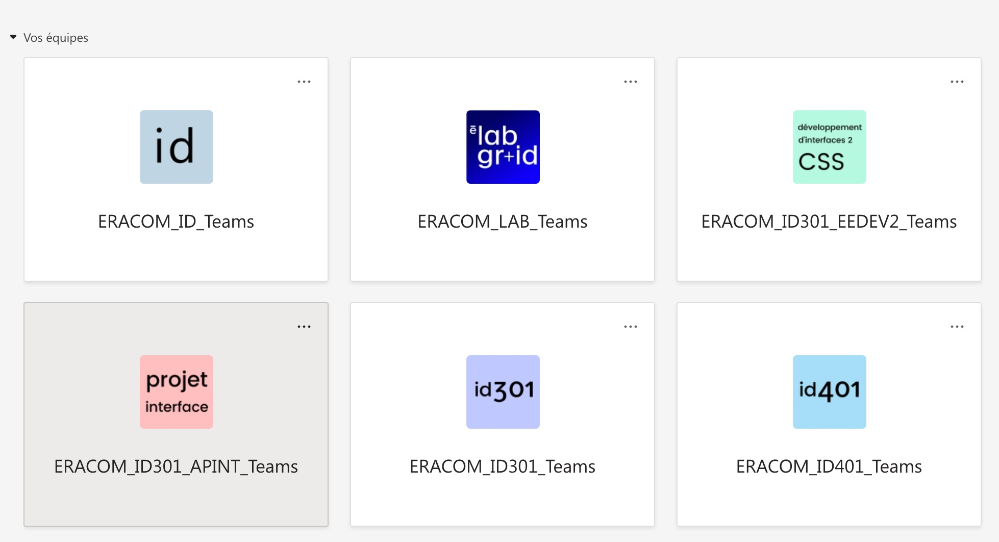
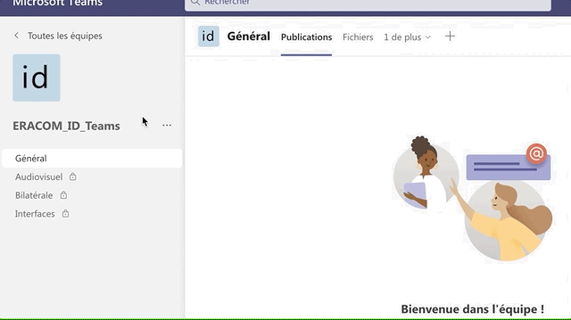

# Icônes pour classes ID

Ce dossier contient des icônes pouvant être utilisées pour représenter des classes, notamment sur Teams. Cela permet aux élèves de distinguer plus facilement les classes.

### Exemple: utilisation des icônes dans Teams

### Où est le fichier source ?

- [Dans Figma, à cette adresse](https://www.figma.com/file/jLlliwkpH2sBLiNMMVXoAU/Github-icons?node-id=0%3A1).
- Au format Sketch, dans le dossier `source`.

Le fichier source utilise différentes fontes, notamment Poppins, Segoe Ui, et AB NewutClassic. Choisissez la fonte et la couleur qui vous convient, il n'y a pas de charte graphique imposée.

### Comment trouver les paramètres

Pour importer votre icône dans Teams:

- Cliquer sur les ... à côté du nom de l'équipe
- Choisir **Gérer l'équipe**
- Choisir l'onglet **Paramètres**
- Déplier **Image de l'équipe**, puis **Modifier l'image**

